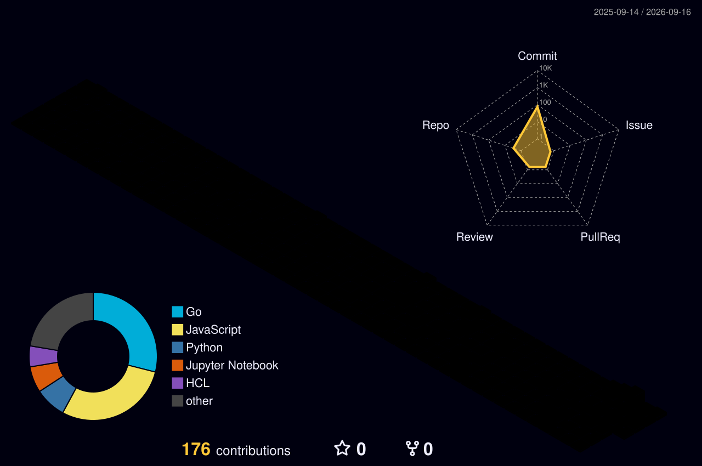

# Kevin Anugerah Faza

**AI/ML & Systems Engineer** · Information Technology at [Institut Teknologi Sepuluh Nopember (ITS)](https://www.its.ac.id) · Surabaya, Indonesia

Building autonomous AI agent harnesses, real-time distributed data pipelines, and high-throughput backend infrastructure.

---

### Tech Stack

 

| Domain | Technologies, Frameworks & Engines |
| :--- | :--- |
| **Languages** | `Go`, `Python`, `TypeScript`, `JavaScript`, `SQL`, `C`, `C++`, `Java`, `Kotlin`, `Bash`, `HCL (Terraform)` |
| **AI, LLM & Data Science** | `PyTorch`, `Hugging Face`, `Transformers`, `Scikit-learn`, `vLLM`, `Ollama`, `LM Studio`, `LangChain`, `LlamaIndex`, `RAGAS`, `Pandas`, `NumPy`, `spaCy`, `OpenCV`, `Jupyter Notebook`, `RAG`, `Prompt Engineering` |
| **Data Platforms & Storage** | `Apache Kafka`, `Apache Spark`, `ClickHouse`, `PostgreSQL`, `MongoDB`, `MariaDB`, `MySQL`, `Redis`, `Prefect` |
| **Backend & Web** | `FastAPI`, `Celery`, `Uvicorn`, `HTTPX`, `REST APIs`, `Telegram Bot API`, `Trafilatura`, `Feedparser`, `React`, `Next.js`, `Vue.js`, `Tailwind CSS` |
| **Cloud, DevOps & MLOps** | `Docker`, `Kubernetes`, `Terraform`, `GitHub Actions`, `Linux / WSL`, `Git`, `MLflow`, `Google Cloud Platform (GCP)`, `Amazon Web Services (AWS)`, `DigitalOcean`, `Vercel`, `Netlify` |

---

### Active Engineering & Focus

- **Autonomous Agent Systems**: Engineering sandboxed tool-execution environments, multi-agent coordination pipelines, structured output validation, and low-latency local model inference serving.
- **Distributed Data Platforms**: Architecting real-time event ingestion streams, analytical lakehouse ETL workflows, and high-throughput OLAP query optimization.
- **Scalable Backend Infrastructure**: Designing asynchronous service architectures, decoupled background task worker queues, and resilient containerized orchestration.

---

### Activity & Telemetry

  

<picture>
  <source media="(prefers-color-scheme: dark)" srcset="./profile-3d-contrib/profile-night-rainbow.svg">
  <source media="(prefers-color-scheme: light)" srcset="./profile-3d-contrib/profile-green-animate.svg">
  
</picture>

---

### Connect

  &nbsp;
  &nbsp;
  

